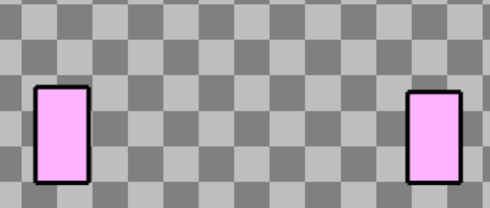
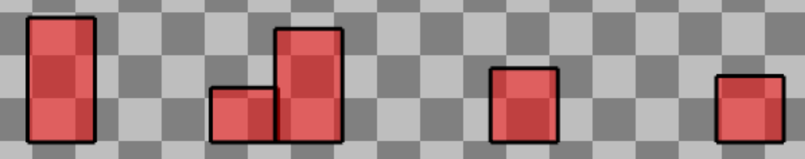

# Entry 3
##### 2/12/2023

I kept using [replit](https://replit.com/~) to help me learn [kaboom js](https://kaboomjs.com/). I still used the `Learn` tab that was on the left side to finish the intro tutorial.

Here are some of the concepts that I have learned:
**Components**
* `circle()` - makes a circle
* `origin()` - starting point like `origin("center")`
* `opacity()` - from 0 - 1, you can set how opaque you want the sprite or object to be
**Events**
* `onHover()` - runs an event when the mouse hovers on an object
**Info**
* `time()` - takes the total time ever since it ran
* `isKeyDown()` - a boolean that tells you if a specific key is pressed down
* `shake()` - shakes the computer screen

The tutorial taught me how to create a loop that made "trees"

*The original code*
```js
function spawnTree() {

		add([
			rect(48, rand(32, 96)),
			area(),
			outline(4),
			pos(width(), height() - FLOOR_HEIGHT),
			origin("botleft"),
			color(255, 180, 255),
			move(LEFT, SPEED),
			"tree",
		]);


		wait(rand(0.5, 1.5), spawnTree);

	}

    spawnTree();
```

What the add() does is that it is adding a tree object that the width of 48 and a randon height between 32 to 96. The tree has a border thickness of 4 (it comes from the outline() ). Here's the part that makes it a loop:
`wait(rand(0.5, 1.5), spawnTree);`

After we created a tree object, we will with from 0.5 to 1.5 seconds and then repeat the process of creating a tree object again.

*My tinkered version*
```js
function spawnTree() {

		add([
			rect(50, rand(40, 96)),
			area(),
			outline(3),
			pos(width(), height() - FLOOR_HEIGHT),
			origin("botleft"),
			color(255, 0, 0),
			move(RIGHT, SPEED),
            opacity(0.5),
			"tree",
		]);


		wait(rand(0.1, 1.0), spawnTree);

	}

    spawnTree();
```

I created a tree that had a width of 50 and a randon height of 40 - 96. The border thickness is 3 instead of 4. The color of the tree is now red instead of pink and the opacity is 0.5 which gives a more transparent look instead of the default 1.0 opacity.

I am currently in stages 3 and 4 of the **Engineering Design Process (EDP)** which is to *brainstorm possible solutions* and *plan the most promising solution*. Right now, I am still learning my tool. Although these steps of the EDP are not directly related to the stages, learning my tool will help me brainstorm possible solutions and plan the most promising solutions later. The next step of the **EDP** is to *create a prototype* where I am going to build my game in a later time.

I am improving on the skills of *how to learn* and *how to Google*. I am still learning my tool which I need to learn by myself. Learning what to type(Google) is essential to helping me learn the necessary information.

My goal for my learning is to try to learn all the necessary information I need to help me make my game. As I am going to make a step-by-step cake making game, I will certainly need to learn

[Previous](entry02.md) | [Next](entry04.md)

[Home](../README.md)