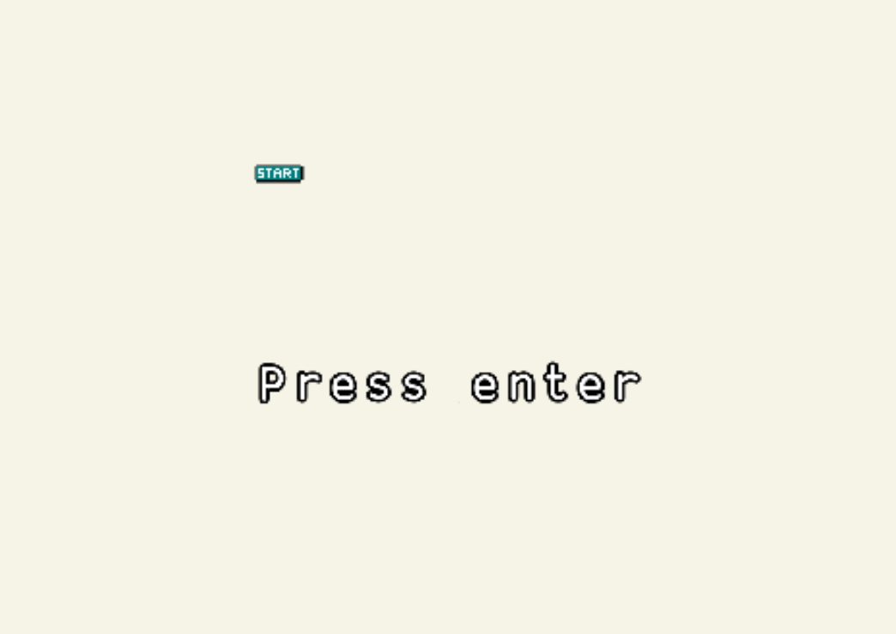

# Entry 4
##### 3/13/23

### Content
I still used [replit](https://replit.com/~) to help me learn [kaboom js](https://kaboomjs.com/).

I have been trying to make sprites of my own on replit. At first, it was hard for me to use it. I didn't know how to create one until I found this [link](https://docs.replit.com/tutorials/kaboom/kaboom-editor). Creating sprites wasn't really a challenge. I just needed to do some research.

Here are is a sprite that I have made:

This sprite will be used for my intro to the game.

I got to learn how sprites work. You first need to create a sprite. After that, you
load your sprite like this:
```js
loadPedit("baking soda", "sprites/baking soda.pedit");
```
Then, you can make your sprite appear like this:
```js
add([
    sprite("start"),
])
```

I then went on to learn about scenes. Scenes in kaboom are just like stages you would see in video games. Creating scenes was not a complicated topic to learn. Here's a format of how the code for a scene should look like:
```js
scene("intro", () => {
  add([
    sprite("start"),
    pos(width()/2, height()/2),
    scale(10),
    origin("center"),
  ])
})
go("intro");
```
`"intro"` is the scene's name. `() => {//code inside}` means the scene will activate the code you have written inside.

#### Progress Towards MVP
For my MVP, I have started making more sprites for the ingredients of a cake. In addition, I have started making the intro of my game. Here's what the intro looks like right now:
```js
scene("intro", () => {
  add([
    sprite("start"),
    pos(width()/2, height()/2),
  ])
  add([
    text("Press enter", {
      size: 30,
      width: width() - 24,
    }),
    pos(width()/2, height()/2+100),
  ])
  onClick(() => {
    go("first")
  })
})
```


I am currently in **stage 4** of the **EDP (Engineering Design Process)** which is to `plan the most promising solution`. I am a little on **stage 5** of the EDP which is to `create a prototype` where I am going to build my MVP. I have most of the information I need to build my MVP. I still need some time to tinker with kaboom given the endless possiblities I can make with this tool.

I am improving on the skills of *how to learn* and *how to Google*. Since I still need to learn kaboom a little more, the skill of *how to learn* is still crucial in this state. This skill will help me learn about the tool as much as possible. Learning *how to Google* is very important right now as I need help understanding what this line of code does and how does this line of code work. I can search how people have learned this code and it will apply to my learning.

[Previous](entry03.md) | [Next](entry05.md)

[Home](../README.md)