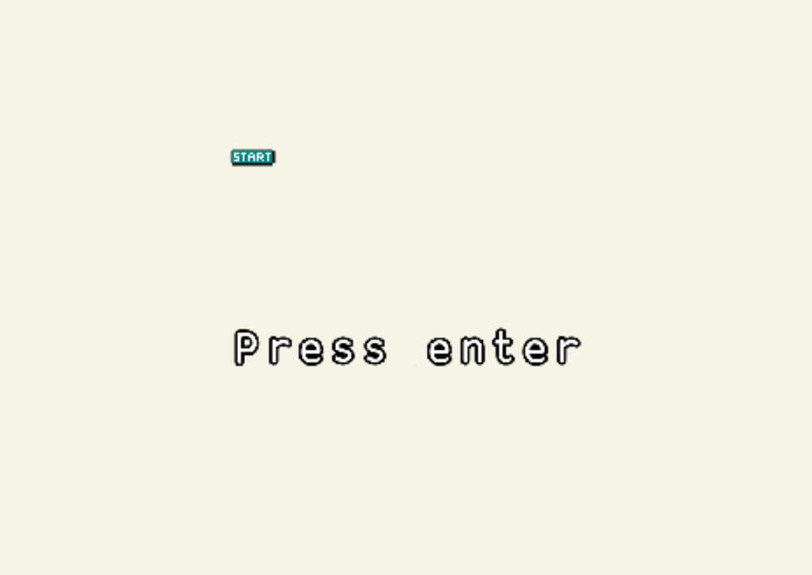
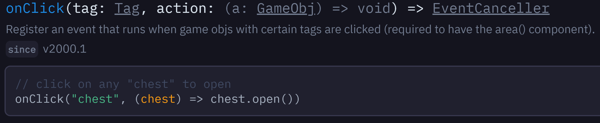
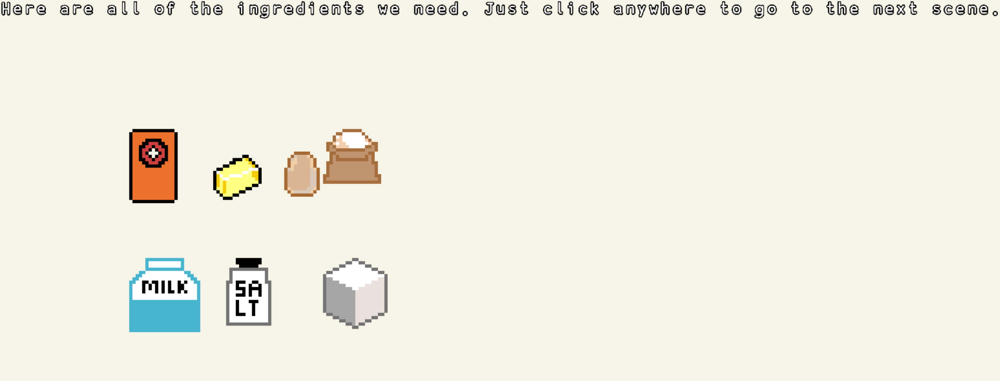
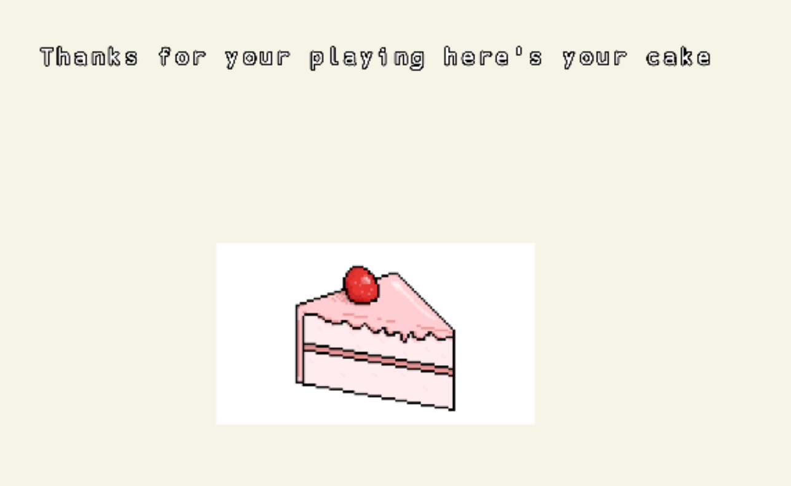

# Entry 5
##### 4/17/23

### Process of My MVP
My MVP is on the [replit](https://replit.com/) website. As I started making my intro to my game, my sprites were very small. I didn't know how to make them bigger until I got help from Jessica who said that you need to use `scale()`. Here is my code before:
```js
scene("intro", () => {
  add([
    sprite("start"),
    pos(width()/2, height()/2),
  ])
})
go("intro");
```

Code after:

```js
scene("intro", () => {
  add([
    sprite("start"),
    pos(width()/2, height()/2),
    scale(10),
  ])
  add([
    text("Press Enter", {
      size: 30,
      width: width() - 24,
    }),
    pos(width()/2, height()/2+100),
  ])
})
go("intro");
```


To change from one scene to another, I tried doing this:
```js
onClick("enter", () => {
    go("first")
})
```
The problem with that was when I clicked on the `enter` sprite, nothing changed. I didn't go to the `first` scene. When I tried doing this:
```js
onClick(() => {
    go("first")
})
```
It solved the switching scenes part, but not the sprite part because the code above means anywhere that I click will go to the first scene which is not what I want. I tried talking to friends and using [slack](https://slack.com/) to find what is going wrong. I didn't have an answer to this problem. I tried looking on [kaboom](https://kaboomjs.com/) to see the syntax of this method and here's what I found:

I followed the syntax by making sure I have an `area()` component and it still didn't work. I decided to use `onKeyPress()` instead. Here's what I did:
```js
onKeyPress("enter", () => {
    go("first")
})
```
The code actually worked. Now, it was time for my first scene. I added the ingredient sprites. I intentionally wanted the player to click the sprites to disappear but I still don't know how to click on a sprite work. I instead make this first scene about the ingredients we need for the cake.
```js
scene("first", () => {
  add([
    sprite("baking soda"),
    pos(200, 200),
    scale(5),

  ])
  add([
    sprite("butter"),
    pos(300, 200),
    scale(5),
  ])
  add([
    sprite("egg"),
    pos(400, 200),
    scale(5),
  ])
  add([
    sprite("flour"),
    pos(500, 200),
    scale(5),
  ])
  add([
    sprite("milk"),
    pos(200, 400),
    scale(5),
  ])
  add([
    sprite("salt"),
    pos(350, 400),
    scale(5),
  ])
  add([
    sprite("sugar"),
    pos(500, 400),
    scale(5),
  ])
  add([
    text("Here are all of the ingredients we need. Just click anywhere to go to the next scene.", {
      size: 30,
      width: width() - 24,
    })
  ])
  onClick(() => go("second"))
})
```


In the code above, I added all of the ingredient sprites and instructions for this first scene. If we go to the second and third scene, I wanted the player to just press a key for this amount of times until it takes you to the next scene. I first created a number counter counting how many times I have pressed a key.
```js
var times = 0;

  onKeyPress("m", () => {
    times++
       const timesCounter = add([
    text(times),
    pos()
  ])
  timesCounter.text = times
})
```
I have created a variable to store the numbers in. In addition, I have created a text that will display the numbers of times you pressed a key. In this code, for every time I pressed `m`, the text will display the variable times which is updating every time I pressed `m`. After that, I created a conditional that will switch to the next scene after a key was pressed x amount.
```js
if(times === 50){
    go("third")
}
```
This was a problem though. When I reached to 50 times, the scene didn't switch to the third scene. I tried many times to solve this issue like instead of `times`, I wrote `timesCounter.text === 50`. This didn't solve the problem though.

For my last scene, the ending, I decided a simple thank you page.
```js
scene("ending", () => {
  add([
    text("Thanks for your playing here's your cake",{
      size:25,
    }),
    pos(width()/2,height()/2),
    origin("center"),
  ])
  add([
    sprite("cake"),
    scale(0.5),
    pos(width()/2,height()/2 + 200),
    origin("center"),
  ])
})
```


In the **Engineering Design Process (EDP)**, I am on stages 5 and 6 of the EDP which are to *create a prototype* and *test and evaluate the prototype*. Right now, I have created my MVP (Minimum Viable Product). I still need to fix some minor errors.

The skills I have picked up for this blog are **Embracing Failure** and **Debugging**. At this moment in time, I am creating an actual functional game. Creating a game is going to include bugs and errors which you can't avoid. Sometimes I can't always get the result I want. Sometimes you need to compromise.

[Previous](entry04.md) | [Next](entry06.md)

[Home](../README.md)